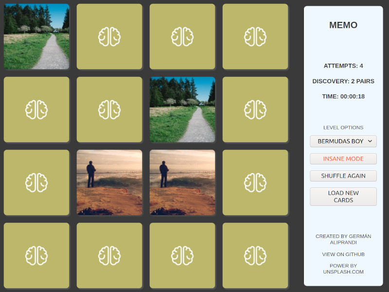

# Memo

### Memo is a nice adaptation of the classic game to test your memory.

### With simple levels that are useful for training fine motor skills in young children or people with mobility problems, to completely unhealthy levels that will unhinge even the most sane.

## Play on: https://galiprandi.github.io/memo/

---

Created by: Germán Aliprandi

---

## Why?

Memo is an exercise with which I seek to improve logic and programming, without greater pretensions than those.

So I have decided to use pure HTML, CSS and JS.

Feel free to send me suggestions, comments or PR if you wish.
